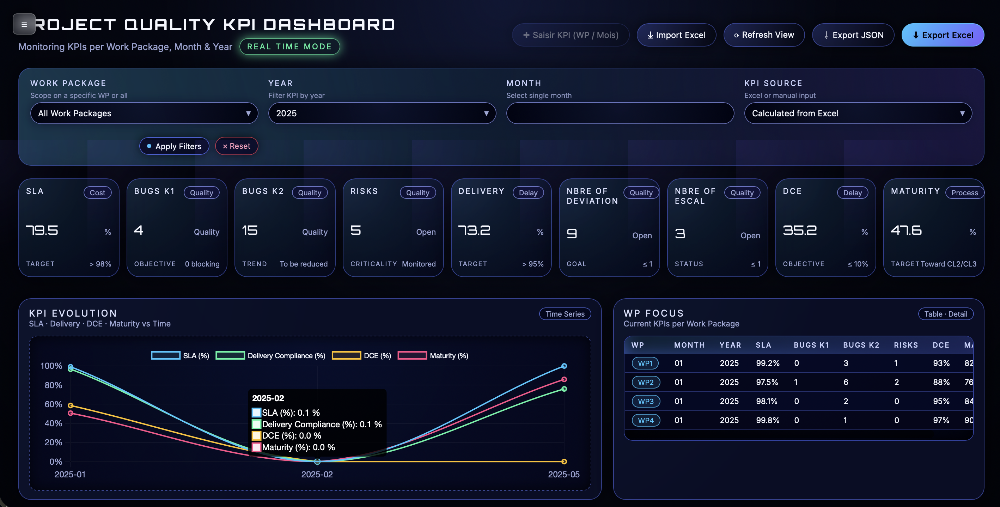

# 🚀 Quality KPI Dashboard – Futuristic Edition  
### 📊 Monitoring KPIs per Work Package · Month · Year (Real-Time Simulation Mode)

Bienvenue dans **Dashboard QA**, un tableau de bord moderne, futuriste et ultra-fluide conçu pour les **Quality Engineers**, **Project Managers** et **DevOps/QA Leads**.

Ce projet permet de visualiser les KPIs clés d’un projet selon un **Work Package**, une **année** et un **mois**, avec une interface immersive et élégante.

---

## 🌌 ✨ Demo UI (Screenshot)
> 

---

## 🧩 **Fonctionnalités principales**

### ✔️ 1. **Visualisation dynamique des KPIs**
- SLA (%)  
- Bugs K1 / Bugs K2  
- Risks / Criticality  
- Delivery Compliance  
- Deviations  
- Escalations  
- DCE (%)  
- Maturity (%)  

### ✔️ 2. **Filtrage avancé**
Filtre instantanément les KPIs selon :
- Work Package  
- Année  
- Mois  
- Source (Excel ou Saisie Manuelle – mode désactivé pour le moment)

### ✔️ 3. **Graphiques en Time-Series**
Visualisation de l’évolution :
- SLA  
- Delivery  
- DCE  
- Maturity  

Grâce à **Chart.js**.

### ✔️ 4. **Import & Export Excel**
- Importation d’un fichier Excel pour charger les KPI mensuels  
- Export JSON  
- Export Excel multi-feuilles (Manual_KPIs + Excel_KPIs)

### ✔️ 5. **Mode Full-Screen avec Sidebar Toggle**
Affichage immersif type cockpit :
- Masquage de la barre latérale  
- Dashboard en pleine largeur  
- Animation smooth futuriste

---

## 🛠 **Technologies utilisées**

| Technologie | Rôle |
|------------|------|
| **HTML5 / CSS3 futuriste** | UI immersive néon |
| **JavaScript Vanilla** | Gestion dynamique & filtrage |
| **Chart.js** | Graphiques interactifs |
| **SheetJS (XLSX.js)** | Import/Export Excel |
| **GitHub Pages (optionnel)** | Déploiement web |
| **Safari / Chrome** | Compatible multi-navigateurs |

---

## 📦 **Installation**

### 1️⃣ Cloner le repo
```bash
git clone git@github.com:Dhafer84/DashboardQA.git
cd DashboardQA
